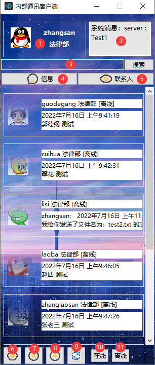
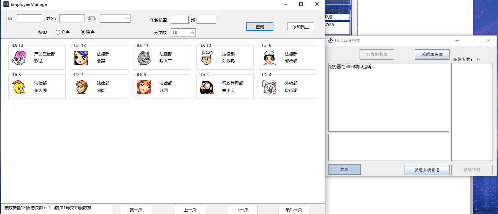

## MUChat

### 1、基本信息

局域网通信系统，实现局域网接收(发送)消息(文件)，本地存储聊天记录使用swt，swing，awt

信息接发系统基于[cckevincyh](https://github.com/cckevincyh)/**[ChatRoom](https://github.com/cckevincyh/ChatRoom)** 修改而成 

工具：Eclipse

jar包：

mysql-connector-java-5.1.6-bin.jar

ojdbc6.jar

```
com.mu   
    +-client.chat_room     //客户端服务 聊天记录写入与加载
    +-common               //实例对象
    +-config			   //配置文件
    +-dao				   //数据访问
    +-download			   //存放客户端下载文件	服务端文件在src下
    +-image				   //存放图片 头像，背景，icon
    +-message			   //消息记录	 
    +-server.chat_server   //服务端服务
    +-utils				   //工具包	
    +-view				   //主窗口包 	
  	+-example.sql          //数据库示例
```

### 2、使用

##### 1.根据sql文件建立数据库，更改db.properties文件

##### 2. 运行 server.chat_server.run下Run.java  开启服务器

##### 3. 运行view.Login.java 进入登录界面

### 3、主界面




1. 用户基本信息  显示头像，用户名，部门名

2. 系统消息  由服务端发出，默认保存在用户聊天记录文件夹下System，显示最后一次系统消息

3. 搜索打开聊天框，根据用户名搜索  存在且在线打开聊天框，离线则打开聊天记录
4. 显示自己部门的员工，在线会显示在最前面显示，头像保持在线高亮状态，离线头像进入半隐状态
5. 通过树的形式显示全部员工，双击用户可打开在线用户界面，否则打开聊天记录
6. 更改用户基本信息 其中透明度只会改变登录和主界面窗口透明度
7. 退出客户端
8. 打开聊天室，相当于群聊，记录存储在记录文件夹中与用户名相同的文件中
9. 刷新 会刷新 系统消息、信息、以及联系人状态消息等信息
10. 设置自身为在线状态
11. 设置自身为离线状态

### 4、服务端



管理所有员工基本信息，通过分页查询所有员工，双击头像可编辑员工信息